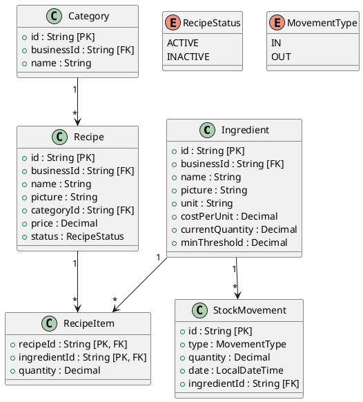

# Inventory Service

This service is built with ASP.NET Core Web API 8.0.

## Table of Contents

* [Environment File](#environment-file)
* [Dependencies Installation](#dependencies-installation)
* [Development Server](#development-server)
* [Building](#building)
* [Running the Application](#running-the-application)
* [API Documentation](#api-documentation)
* [Classes Diagram](#classes-diagram)

## Environment File

Create the environment file from the example template:

```bash
cp .env.example .env
```

Update the values in `.env` as needed.

## Dependencies Installation

Restore project dependencies:

```bash
dotnet restore
```

## Development Server

Start the application:

```bash
dotnet run
```

Once the application is running, it will be available at:

```text
http://localhost:8083
```

## Building

Build the project:

```bash
dotnet build
```

The compiled output will be generated in the:

```text
bin/
```

directory.

## Running the Application

Run the application:

```bash
dotnet run
```

Or publish and run the compiled application:

```bash
dotnet publish -c Release
```

```bash
dotnet ./bin/Release/net8.0/InventoryService.dll
```

> Replace `InventoryService.dll` with the actual generated DLL filename if different.

## API Documentation

If Swagger is enabled, it can be accessed at:

```text
http://localhost:8083/swagger
```

## Classes Diagram



### Notes

* `RecipeStatus`: `ACTIVE`, `INACTIVE`
* `MovementType`: `IN`, `OUT`
* Each business manages its own ingredients, recipes, and categories through `businessId`.
* Stock movements track inventory increases and decreases.
* Recipes are composed of one or more ingredients through `RecipeItem`.
