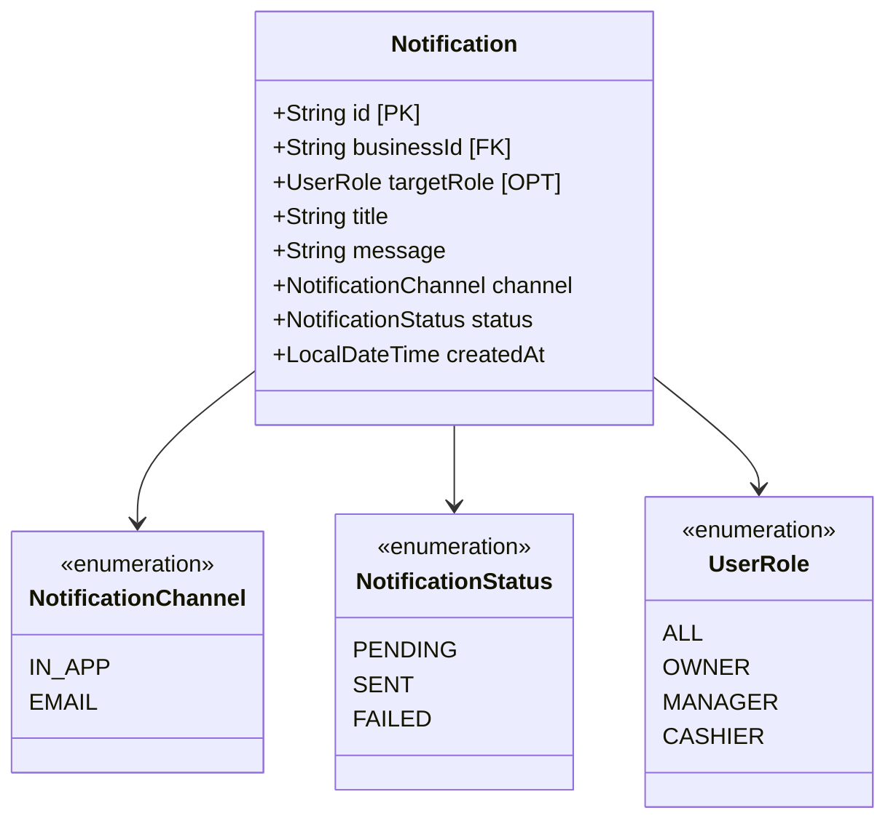

# Notification Service

This service is built with NestJS.

## Table of Contents

* [Environment File](#environment-file)
* [Dependencies Installation](#dependencies-installation)
* [Development Server](#development-server)
* [Building](#building)
* [Running the Application](#running-the-application)
* [Unit Testing](#unit-testing)
* [Classes Diagram](#classes-diagram)

## Environment File

Create the environment file from the example template:

```bash
cp .env.example .env
```

Update the values in `.env` as needed.

## Dependencies Installation

Install project dependencies:

```bash
npm install
```

## Development Server

Start the application in development mode:

```bash
npm run start:dev
```

Once the application is running, it will be available at:

```text
http://localhost:8086
```

## Building

Build the project:

```bash
npm run build
```

The compiled output will be generated in the:

```text
dist/
```

directory.

## Running the Application

Run the compiled application:

```bash
npm run start
```

Or run the production build:

```bash
node dist/main.js
```

## Unit Testing

Run unit tests:

```bash
npm run test
```

## Classes Diagram



### Notes

- `NotificationChannel`: `IN_APP`, `EMAIL`
- `NotificationStatus`: `PENDING`, `SENT`, `FAILED`
- `targetRole` allows notifications to be sent to all users or a specific role.
- `businessId` ensures notifications are isolated per business tenant.
- Notifications can be delivered through in-app messages or email.