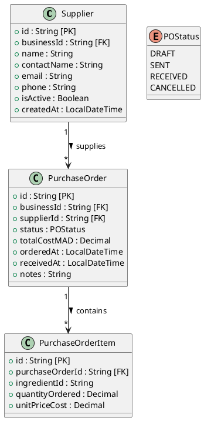

# Procurement Service

This service is built with ASP.NET Core Web API 8.0.

## Table of Contents

- [Environment File](#environment-file)
- [Dependencies Installation](#dependencies-installation)
- [Development Server](#development-server)
- [Building](#building)
- [Running the Application](#running-the-application)
- [Classes Diagram](#classes-diagram)

## Environment File

Create the environment file from the example template:

```bash
cp .env.example .env
```

Update the values in `.env` as needed.

## Dependencies Installation

Restore project dependencies:

```bash
dotnet restore
```

## Development Server

Start the application:

```bash
dotnet run
```

Once the application is running, it will be available at:

```text
http://localhost:8085
```

## Building

Build the project:

```bash
dotnet build
```

The compiled output will be generated in the:

```text
bin/
```

directory.

## Running the Application

Run the application:

```bash
dotnet run
```

Or publish and run the compiled application:

```bash
dotnet publish -c Release
```

```bash
dotnet ./bin/Release/net8.0/ProcurementService.dll
```

> Replace `ProcurementService.dll` with the actual generated DLL filename if different.

## Classes Diagram



### Notes

- `POStatus`: `DRAFT`, `SENT`, `RECEIVED`, `CANCELLED`
- Each `Supplier` can have multiple purchase orders.
- Each `PurchaseOrder` can contain multiple items.
- `businessId` is used to enforce tenant isolation between businesses.
- Receiving a purchase order may trigger inventory stock updates.
