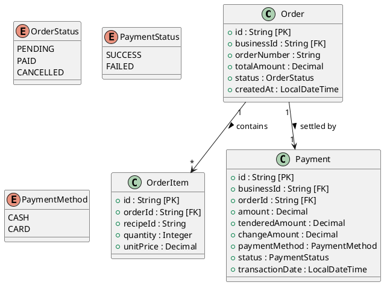

# Sales Service

This service is built with Spring Boot and JDK 25.

## Table of Contents

* [Environment File](#environment-file)
* [Dependencies Installation](#dependencies-installation)
* [Development Server](#development-server)
* [Building](#building)
* [Running the JAR](#running-the-jar)
* [API Documentation](#api-documentation)
* [Classes Diagram](#classes-diagram)

## Environment File

Create the environment file from the example template:

```bash
cp .env.example .env
```

Update the values in `.env` as needed.

## Dependencies Installation

Install project dependencies and download Maven packages:

```bash
mvn clean install
```

## Development Server

Start the application:

```bash
mvn spring-boot:run
```

Once the application is running, it will be available at:

```text
http://localhost:8084
```

## Building

Build the project and generate the JAR file:

```bash
mvn clean package
```

The generated JAR file will be located in:

```text
target/
```

## Running the JAR

Run the generated JAR file:

```bash
java -jar target/sales-service-25.jar
```

> Replace `sales-service-25.jar` with the actual generated JAR filename if different.

## API Documentation

If Swagger/OpenAPI is enabled, it can be accessed at:

```text
http://localhost:8084/swagger-ui/index.html
```

## Classes Diagram



### Notes

* `OrderStatus`: `PENDING`, `PAID`, `CANCELLED`
* `PaymentStatus`: `SUCCESS`, `FAILED`
* `PaymentMethod`: `CASH`, `CARD`
* Each business manages its own orders and payments through `businessId`.
* `unitPrice` stores the recipe price at the moment of sale.
* `Payment` records the final transaction associated with an order.
