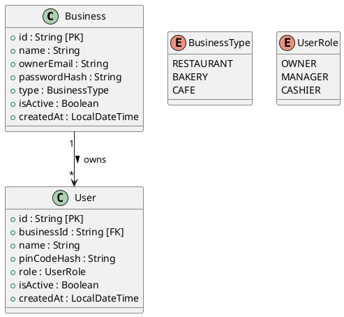

# User Service

This service is built with Spring Boot and JDK 25.

## Table of Contents

- [Environment File](#environment-file)
- [Dependencies Installation](#dependencies-installation)
- [Development Server](#development-server)
- [Building](#building)
- [Running the JAR](#running-the-jar)
- [Classes Diagram](#classes-diagram)

## Environment File

Create the environment file from the example template:

```bash
cp .env.example .env
```

Update the values in `.env` as needed.

## Dependencies Installation

Install dependencies and download Maven packages:

```bash
mvn clean install
```

## Development Server

Start the application:

```bash
mvn spring-boot:run
```

Once the application is running, it will be available at:

```text
http://localhost:8083
```

## Building

Build the project:

```bash
mvn clean package
```

The generated JAR file will be located in:

```text
target/
```

## Running the JAR

Run the generated JAR file:

```bash
java -jar target/user-service-25.jar
```

> Replace `user-service-25.jar` with the actual generated JAR filename if different.

## Classes Diagram



### Notes

- `BusinessType`: `RESTAURANT`, `BAKERY`, `CAFE`
- `UserRole`: `OWNER`, `MANAGER`, `CASHIER`
- Each `Business` can have multiple `User` accounts.
- Users belong to a single business tenant.
